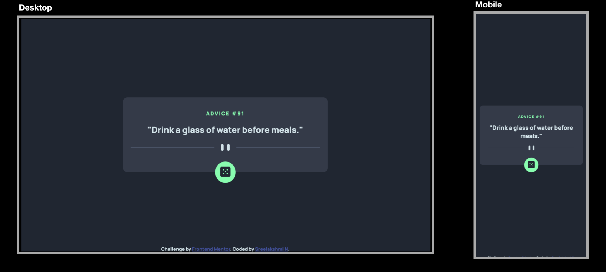

# Advice generator app

This is a solution to the [Advice generator app challenge on Frontend Mentor](https://www.frontendmentor.io/challenges/advice-generator-app-QdUG-13db).

## Table of contents

- [Overview](#overview)
  - [The challenge](#the-challenge)
  - [Screenshot](#screenshot)
  - [Links](#links)
- [My process](#my-process)
  - [Built with](#built-with)
  - [What I learned](#what-i-learned)
  - [Continued development](#continued-development)
  - [Useful resources](#useful-resources)
- [Author](#author)
- [Acknowledgments](#acknowledgments)

## Overview

### The challenge

Users should be able to:

- View the optimal layout for the app depending on their device's screen size
- See hover states for all interactive elements on the page
- Generate a new piece of advice by clicking the dice icon

### Screenshot



### Links

- [Solution URL](https://github.com/sree-lakshmi-n/frontend-mentor/tree/main/advice-generator-app)
- [Live Site URL](https://advice-generator-app.sree112.repl.co)

## My process

### Built with

- Semantic HTML5 markup
- CSS custom properties
- Flexbox
- CSS Grid
- Mobile-first workflow
- [Sass](https://sass-lang.com/)
- JS library

### What I learned

Learnt to make an API call using fetch API, Async and Await.

```js
async function getQuote() {
  let response = await fetch("https://api.adviceslip.com/advice");
  let data = await response.json();
  return data;
}

getQuote().then((data) => console.log(data));
```

Object destructuring

```js
let {
  slip: { id, advice },
} = data;
```

Adding event listener on a CSS pseudo element

```js
  element { pointer-events: none; }
  element::after { pointer-events: all; }
```

### Continued development

- Develop the same with ReactJS

### Useful resources

- [All possible ways of making an API call in JavaScript](https://levelup.gitconnected.com/all-possible-ways-of-making-an-api-call-in-plain-javascript-c0dee3c11b8b)
- [Third-party APIs](https://developer.mozilla.org/en-US/docs/Learn/JavaScript/Client-side_web_APIs/Third_party_APIs) - MDN documentation on Third-party APIs
- [Advice Slip JSON API](https://api.adviceslip.com/)
- [Adding event listener on a CSS pseudo element](https://stackoverflow.com/questions/9395858/event-listener-on-a-css-pseudo-element-such-as-after-and-before)

## Author

- Frontend Mentor - [@sree-lakshmi-n](https://www.frontendmentor.io/profile/sree-lakshmi-n)
- Twitter - [@its_sreelakshmi](https://www.twitter.com/its_sreelakshmi)

## Acknowledgments

- [Jonas Schmedtmann's Udemy courses](https://www.udemy.com/user/jonasschmedtmann/)
