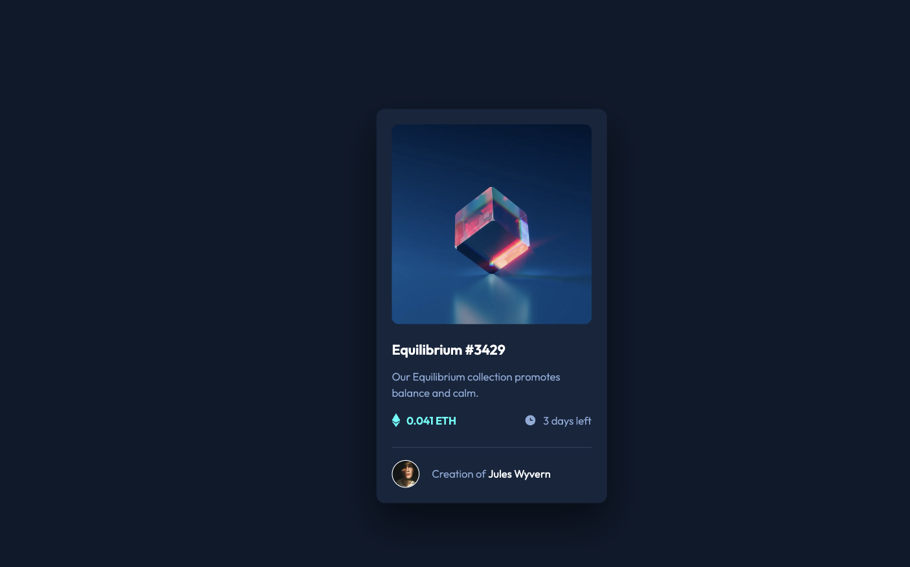
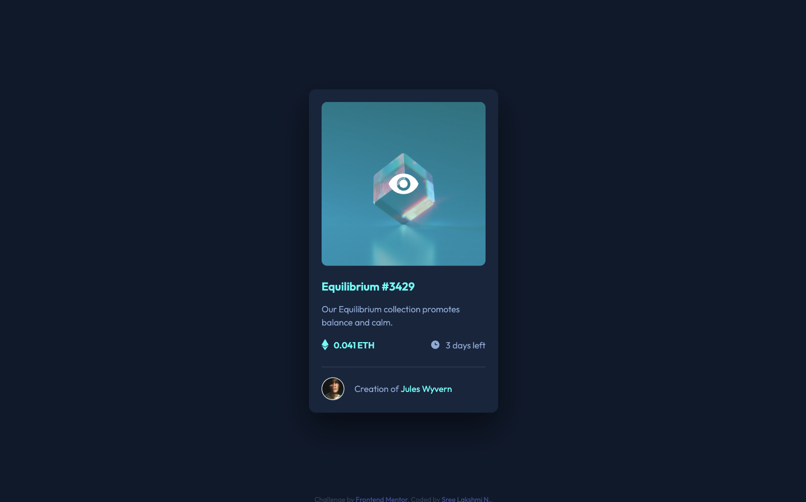
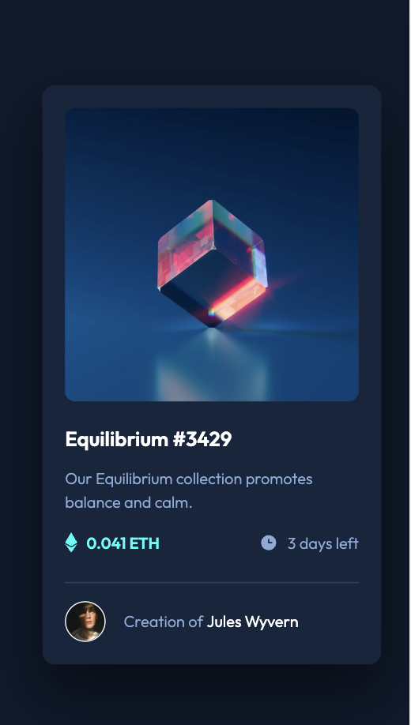
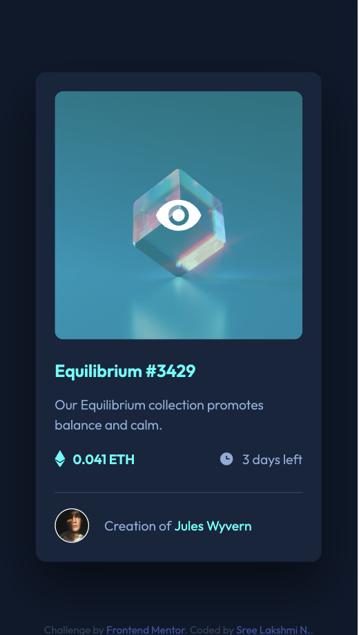

# NFT preview card component

This is a solution to the [NFT preview card component challenge](https://www.frontendmentor.io/challenges/nft-preview-card-component-SbdUL_w0U) on Frontend Mentor.

## Table of contents

- [Overview](#overview)
  - [The challenge](#the-challenge)
  - [Screenshot](#screenshot)
  - [Links](#links)
- [My process](#my-process)
  - [Built with](#built-with)
  - [What I learned](#what-i-learned)
  - [Continued development](#continued-development)
  - [Useful resources](#useful-resources)
- [Author](#author)

## Overview

### The challenge

Users should be able to:

- View the optimal layout depending on their device's screen size
- See hover states for interactive elements

### Screenshot

<p> Desktop Preview and Active States</p>
<p style="text-align:center;">
  
   
</p>
<p> Mobile Preview and Active States</p>
<p style="text-align:center;">
  
  
</p>

### Links

- [Solution URL](https://github.com/sree-lakshmi-n/frontend-mentor/tree/main/nft-preview-card-component)
- [Live Site URL](https://nft-preview-card-component.sree112.repl.co)

## My process

### Built with

- Semantic HTML5 markup
- CSS custom properties
- Flexbox
- Mobile-first workflow

### What I learned

Added border-shadow to nft card

```css
box-shadow: 0 2.4rem 4.8rem rgba(0, 0, 0, 0.5);
```

Added before icon

```css
.eth-price::before {
  content: url(./images/icon-ethereum.svg);
}
```

Added two background images, one as an overlay

```css
background-image: linear-gradient(
    rgba(0, 255, 247, 0.4),
    rgba(0, 255, 247, 0.4)
  ), url(./images/image-equilibrium.jpg);
```

### Continued development

- Style using SASS/ LESS

### Useful resources

- [Jonas Schmedtmann Udemy Course](https://www.udemy.com/course/design-and-develop-a-killer-website-with-html5-and-css3) - This course helped me a lot to grasp html and css concepts.

## Author

- Website - [Sree Lakshmi N](https://www.your-site.com)
- Frontend Mentor - [@sree-lakshmi-n](https://www.frontendmentor.io/profile/sree-lakshmi-n)
