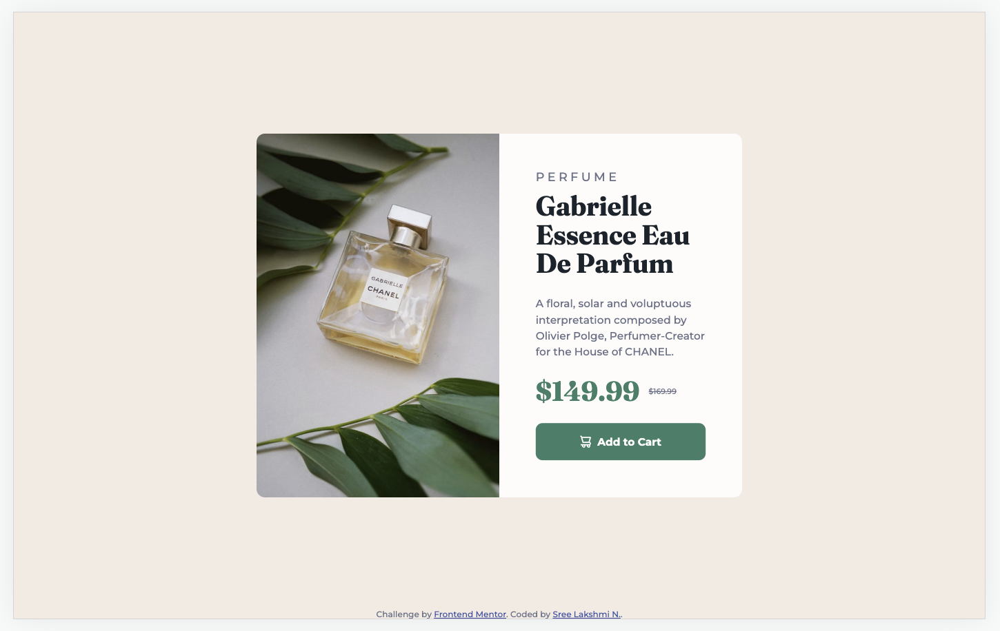
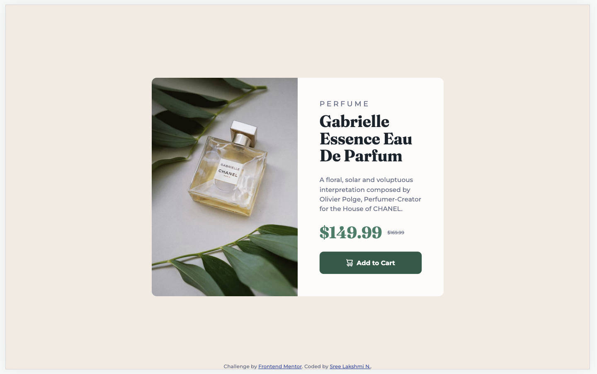
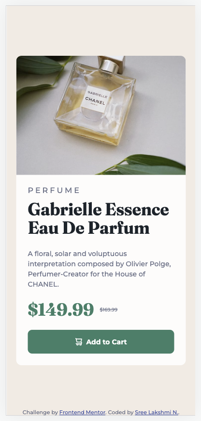
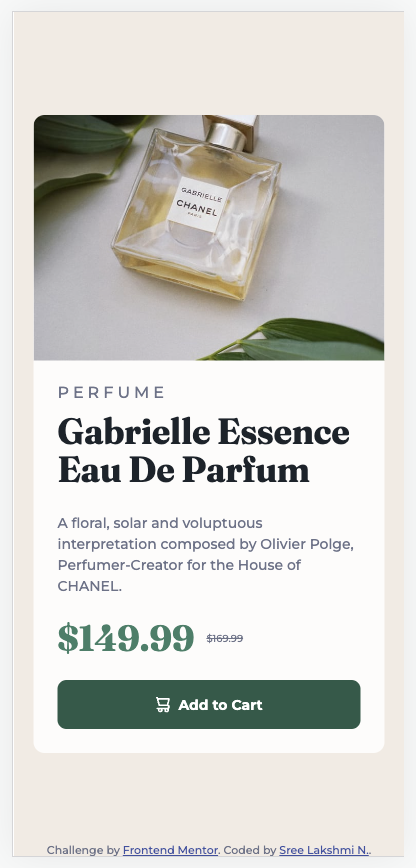

# Product preview card component solution

This is a solution to the [Product preview card component challenge](https://www.frontendmentor.io/challenges/product-preview-card-component-GO7UmttRfa) on Frontend Mentor.

## Table of contents

- [Overview](#overview)
  - [The challenge](#the-challenge)
  - [Screenshots](#screenshots)
  - [Links](#links)
- [My process](#my-process)
  - [Built with](#built-with)
  - [What I learned](#what-i-learned)
  - [Continued development](#continued-development)
  - [Useful resources](#useful-resources)
- [Author](#author)

## Overview

### The challenge

Users should be able to:

- View the optimal layout depending on their device's screen size
- See hover and focus states for interactive elements

### Screenshots

<p> Desktop Preview and Active States</p>
<p style="text-align:center;">
  
   
</p>
<p> Mobile Preview and Active States</p>
<p style="text-align:center;">
  
  
</p>

### Links

- [Solution URL](https://github.com/sree-lakshmi-n/frontend-mentor/tree/main/product-preview-card-component)
- [Live Site URL](https://your-live-site-url.com)

## My process

### Built with

- Semantic HTML5 markup
- CSS custom properties
- Flexbox
- Mobile-first workflow

### What I learned

Used article tag since this product is an independent content.

```html
<article></article>
```

Set browser font size in % \
10px / 16px = 0.625 => 62.5%
(for easier calculation)

```css
html {
  font-size: 62.5%;
}
```

Overflow setting to prevent the image child element of container to have diff border

```css
.container {
  border-radius: 1.1rem;
  overflow: hidden;
}
```

### Continued development

- Using grid for layout
- Using sass/ less in place of css

### Useful resources

- [Tint and Shade Generator](https://maketintsandshades.com/) - This helped me to generate a shade for our primary colour, dark cyan.
- [Stack Overflow](https://stackoverflow.com/questions/2182716/is-it-possible-to-set-the-equivalent-of-a-src-attribute-of-an-img-tag-in-css) - This particular question helped me add product image from css itself.

## Author

- Website - [Sree Lakshmi N.](https://www.your-site.com)
- Frontend Mentor - [@sree-lakshmi-n](https://www.frontendmentor.io/profile/sree-lakshmi-n)
