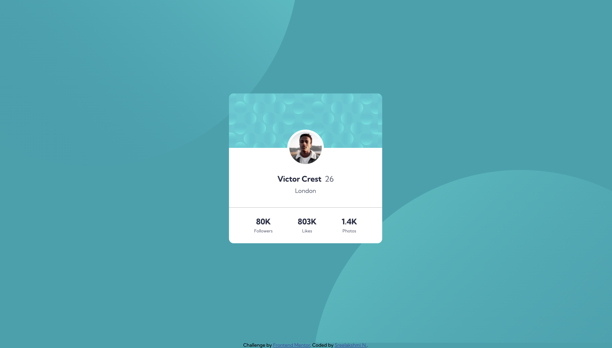

# Profile card component solution

This is a solution to the [Profile card component challenge on Frontend Mentor](https://www.frontendmentor.io/challenges/profile-card-component-cfArpWshJ).

## Table of contents

- [Overview](#overview)
  - [The challenge](#the-challenge)
  - [Screenshot](#screenshot)
  - [Links](#links)
- [My process](#my-process)
  - [Built with](#built-with)
  - [What I learned](#what-i-learned)
  - [Continued development](#continued-development)
  - [Useful resources](#useful-resources)
- [Author](#author)

## Overview

### The challenge

- Build out the project to the designs provided

### Screenshot

Desktop Version

Mobile Version \


### Links

- [Solution URL](https://github.com/sree-lakshmi-n/frontend-mentor/tree/main/profile-card-component)
- [Live Site URL](https://profile-card-component.sree112.repl.co)

## My process

### Built with

- Semantic HTML5 markup
- CSS custom properties
- Flexbox
- Mobile-first workflow

### What I learned

1. Adding a line-break using css

```css
#content::after {
  content: "\a";
  white-space: pre;
}
```

2. Media query for iPad 1, 2, Mini and Air

```css
@media only screen and (min-device-width: 768px) and (max-device-width: 1024px) and (-webkit-min-device-pixel-ratio: 1) {
}
```

3. This was a new info for me. The background position percentage is calculated relative to the resulting number of:

```text
box size - image size = [number used for the percentage calculations]
```

### Continued development

- Positioning svg circles responsively in background
- Using SASS/ LESS for writing styles

### Useful resources

- [Background position percentage](https://stackoverflow.com/questions/29674505/background-position-negative-percentage-values) - It was news to me that the percentage is not calculated from the width/height of the containing box.

- [W3C Documentation on background positioning](https://drafts.csswg.org/css-backgrounds-3/#background-position) - This W3C documentation helps understand the definition of the background positioning better.

- [MDN Documentation on background positioning](https://developer.mozilla.org/en-US/docs/Web/CSS/background-position) - This was also helpful.

- [Media Queries for Standard Devices](https://css-tricks.com/snippets/css/media-queries-for-standard-devices/) - This css-tricks page lists a ton of different devices and media queries that would specifically target that device.

- [Adding a line-break using CSS](https://www.educative.io/answers/how-to-add-a-line-break-using-css) - Even though I didn't use it in the end, it was great to know to add a line-break using CSS.

## Author

- Website - [Sree Lakshmi N](https://www.your-site.com)
- Frontend Mentor - [@sree-lakshmi-n](https://www.frontendmentor.io/profile/sree-lakshmi-n)
