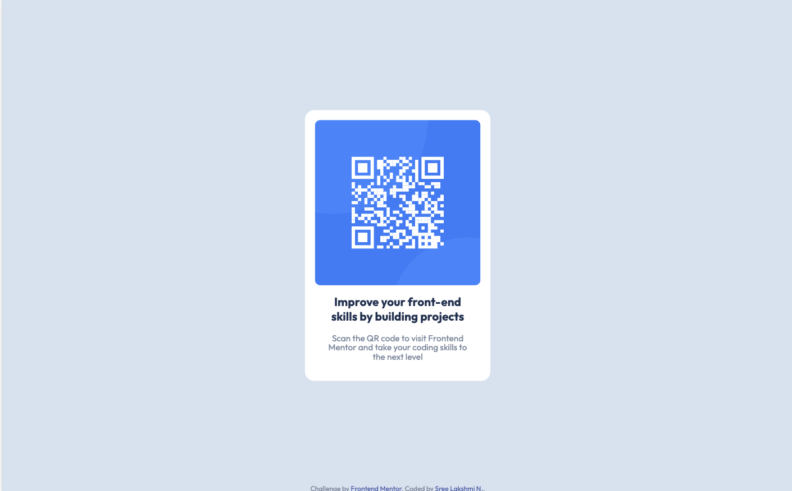

# QR code component

This is a solution to the [QR code component challenge on Frontend Mentor](https://www.frontendmentor.io/challenges/qr-code-component-iux_sIO_H).

## Table of contents

- [Overview](#overview)
  - [Screenshot](#screenshot)
  - [Links](#links)
- [My process](#my-process)
  - [Built with](#built-with)
  - [What I learned](#what-i-learned)
  - [Continued development](#continued-development)
  - [Useful resources](#useful-resources)
- [Author](#author)
- [Acknowledgments](#acknowledgments)

## Overview

### Screenshot

<p>Desktop</p>
<p style="text-align:center;">
  
</p>

<p>Mobile</p>
<p style="text-align:center;">
  
</p>

### Links

- [Solution URL](https://github.com/sree-lakshmi-n/frontend-mentor/tree/main/qr-code-component)
- [Live Site URL](https://qr-code-component.sree112.repl.co)

## My process

### Built with

- Semantic HTML5 markup
- CSS custom properties
- Flexbox
- Mobile-first workflow

### What I learned

Setting browser font size in % \
10px / 16px = 0.625 => 62.5%

```css
html {
  font-size: 62.5%;
}
```

Centering using flex

```css
.center {
  display: flex;
  justify-content: center;
  align-items: center;
}
```

### Continued development

### Useful resources

- [Flexbox Froggy](https://flexboxfroggy.com) - This helped me strengthen flex concepts.
- [Flexbox CSS tricks](https://css-tricks.com/snippets/css/a-guide-to-flexbox) - This is also a cool site you can use as a cheat sheet for flex properties.

## Author

- Website - [Sree Lakshmi N.](https://www.your-site.com)
- Frontend Mentor - [@sree-lakshmi-n](https://www.frontendmentor.io/profile/sree-lakshmi-n)
